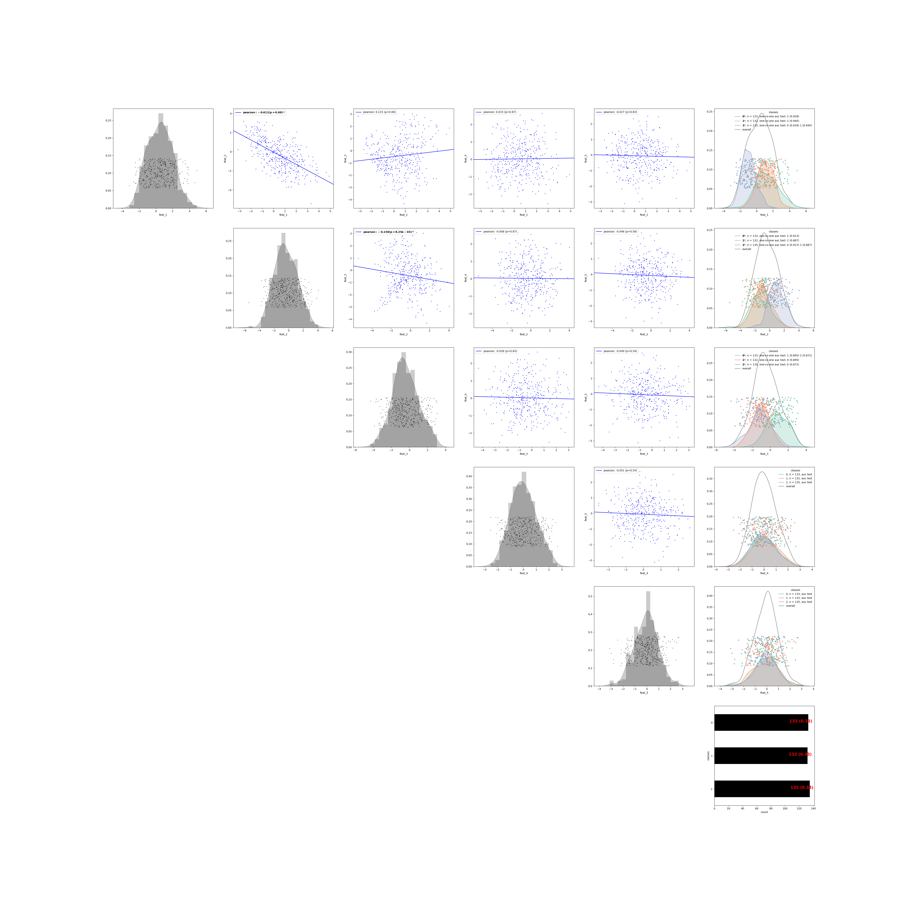

explore
----

**author**: `Iain Carmichael`_

Additional documentation, examples and code revisions are coming soon.
For questions, issues or feature requests please reach out to Iain:
idc9@cornell.edu.

Overview
========

explore provides tools for exploratory data analysis tasks including: comparing many pairs of variables, controlling for multiple testing and creating structured, visual summaries and diagnostics of the results. The idea behind explore is that with the right abstractions we can automate simple analyses without loosing sight of the original data.

The use case motivating this package is the interpretation of unsupervised, exploratory analyses. For example, suppose we have two datasets, X, Y, on a fixed set of observations (e.g. X is a matrix of patient gene expression data and Y is a matrix of patient clinical variables) and we run a clustering algorithm on X. We may then (attempt to) interpret/understand/validate the clusters found in X by looking for associations between these clusters and the Y variables (e.g. the patients in genetic cluster 1 have high blood pressure).

Installation
============

The explore package can be installed via pip or github. This package is currently only tested in python 3.6.

::

    pip install explore (coming soon!)

::

    git clone https://github.com/idc9/explore.git
    python setup.py install

Example
=======

The below example shows how to make all pairwise comparisons of variables in a dataset. More examples can be found in this `basic functionality notebook`_.

.. code:: python

    from sklearn.datasets import make_classification
    import matplotlib.pyplot as plt
    import pandas as pd

    from explore.SingleBlock import SingleBlock

    # make a synthetic dataset
    X, y = make_classification(n_samples=400,
                               n_features=3,
                               n_informative=2,
                               n_redundant=0,
                               n_classes=3,
                               n_clusters_per_class=1,
                               random_state=0)

    # explore is happiest when you pass it pandas objects
    df = pd.DataFrame(X,
                      columns=['feat_{}'.format(i + 1) for i in range(X.shape[1])])
    df['classes'] = y
    # tell explore that 'classes' is a categorical variable
    df['classes'] = df['classes'].astype('category')
    # df['classes'] = df['classes'].astype(str)

    comparisons = SingleBlock(multi_test='fdr_bh',
                              cat_test='auc', multi_cat='ovo')
    comparisons.fit(df)
    # Benjamini-Hochberg for multiple testing correction
    comparisons.correct_multi_tests()
    comparisons.plot()

For more example code see `these example notebooks`_ (including the code to generate the above figures). If the notebooks aren't loading on github you can copy/paste the notebook url into https://nbviewer.jupyter.org/.

Help and Support
================

Additional documentation, examples and code revisions are coming soon.
For questions, issues or feature requests please reach out to Iain:
idc9@cornell.edu.

Documentation
^^^^^^^^^^^^^

The source code is located on github: https://github.com/idc9/explore

Testing
^^^^^^^

Testing is done using `nose`.

Contributing
^^^^^^^^^^^^

We welcome contributions to make this a stronger package: data examples,
bug fixes, spelling errors, new features, etc.

Much of the code was written during the `Summer Workshop on the Dynamic Brain 2019`_  hosted by the Allen institute for Brain Science and the Computational Neuroscience Program at the University of Washington.

.. _Iain Carmichael: https://idc9.github.io/
.. _basic functionality notebook: https://github.com/idc9/explore/tree/master/doc/example_notebooks/basic_functionality.ipynb
.. _these example notebooks: https://github.com/idc9/explore/tree/master/doc/example_notebooks
.. _Summer Workshop on the Dynamic Brain 2019: https://alleninstitute.org/what-we-do/brain-science/events-training/events/summer-workshop-dynamic-brain-2019

